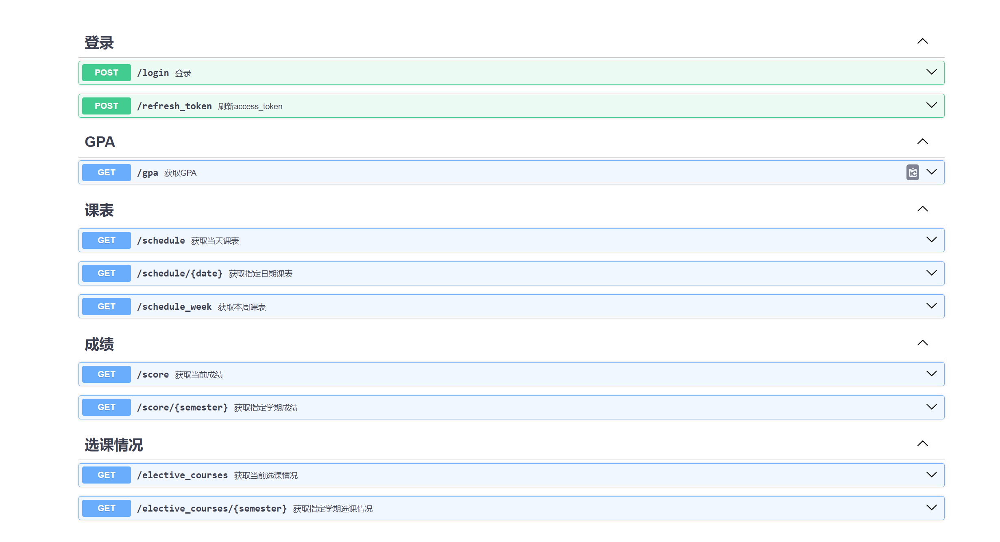

# ecjtu

<div align="center">

[](https://pypi.org/project/ecjtu/)
[](https://github.com/Undertone0809/ecjtu/pulls?utf8=%E2%9C%93&q=is%3Apr%20author%3Aapp%2Fdependabot)

[](https://github.com/astral-sh/ruff)
[](https://github.com/PyCQA/bandit)
[](https://github.com/Undertone0809/ecjtu/blob/main/.pre-commit-config.yaml)
[](https://github.com/Undertone0809/ecjtu/releases)
[](https://github.com/Undertone0809/ecjtu/blob/main/LICENSE)


All your need is ECJTU API SDK service

</div>

## 📚 Introduction

ecjtu 是一个 Pythonic 的 ECJTU API SDK，旨在为开发者提供一个简洁、高效的方式来访问和管理其学籍、成绩、课表等信息，构建自己的应用程序 🌟。

欢迎校友加入 EFC（ECJTU For Code），我们致力于构建一个充满活力的平台，集结校园内外对技术充满热情的开发者、技术爱好者。在这里，您可以自由地分享您的编程知识，展示您的创新项目，以及与志同道合的人一起推动开源文化的发展，make sth happen


<div style="width: 250px;margin: 0 auto;">
    
</div>

> 🌟 This project is generated by [3PG](https://github.com/Undertone0809/3PG), 3PG is a Python Packages Project Generator-Your next Python package needs a bleeding-edge project structure.

## 💡 Features

- 获取课程表信息
- 获取成绩信息
- 获取绩点信息
- 获取选修课程信息
- 提供对应的异步版本
- Web 服务器提供 API 服务

⛔ 不做偏应用层的开发，专注于提供核心的数据服务。



## 📗 Usage

打开终端命令行，输入以下命令：

```shell
pip install ecjtu
```

下面将介绍 ECJTU 的基本使用方式，接下来，我们导入 `ECJTU` 类，并构造一个 client 进行登录。

```python
from ecjtu import ECJTU

client = ECJTU(stud_id="your student id", password="pwd")
```

如果你的代码会存储在远程仓库中，我们推荐将学号和密码保存在环境变量中，ECJTU 支持以环境变量的方式初始化，下面是两种使用环境变量初始化的方式。

### 方法一

```python
import os
from ecjtu import ECJTU

os.environ["ECJTU_STUDENT_ID"] = "xxx"
os.environ["ECJTU_PASSWORD"] = "xxx"

client = ECJTU()
```

### 方法二
使用 [dotenv](https://pypi.org/project/python-dotenv/) 库，将学号和密码保存在 `.env` 文件中，在项目根目录下创建 `.env` 文件，内容如下：

```text
ECJTU_STUDENT_ID=xxx
ECJTU_PASSWORD=xxx
```

然后在代码中使用如下方式初始化 client：

```python
from dotenv import load_dotenv
from ecjtu import ECJTU

load_dotenv()
client = ECJTU()
```

通过这种方式，你可以避免将学号和密码明文保存在代码中，提高安全性。需要注意的是，不要将 `.env` 文件上传到公共仓库中，应在 `.gitignore` 中声明忽略该文件。

### 查询课程表

使用 client，你可以获取选修的课程、课程表、绩点、成绩等信息。下面的示例展示了如何使用 client 获取今日课表。


```python
from typing import List
from ecjtu import ScheduledCourse

courses: List[ScheduledCourse] = client.scheduled_courses.today()
print(courses)
```

Output Example:

```text
[ScheduledCourse(class_span='1,2', course='材料力学(B)', course_name='材料力学(B)(20232-1)', week_span='1-15', course_type='必修课', teacher='程俊峰', week_day=5, class_room='31-504', pk_type='上课'), ScheduledCourse(class_span='3,4', course='Java程序设计(B)', course_name='Java程序设计(B)(20232-2)', week_span='1-16', course_type='限选课', teacher='王珏', week_day=5, class_room='31-311D', pk_type='上课'), ScheduledCourse(class_span='5,6', course='数据库系统原理', course_name='数据库系统原理(20232-2)', week_span='1-16', course_type='必修课', teacher='魏永丰', week_day=5, class_room='31-505', pk_type='上课')]
```

获取本周课表

```python
courses: List[List[ScheduledCourse]] = client.scheduled_courses.this_week()

for day, courses in enumerate(courses):
    print(f"星期{day + 1}")
    for course in courses:
        print(course)
```

Output Example:

```text
星期1
class_span='3,4' course='工程地质学' course_name='工程地质学(20232-1)' week_span='1-12' course_type='限选课' teacher='黄龙华' week_day=1 class_room='31-510' pk_type='上课'
星期2
class_span='5,6' course='软件工程（B）' course_name='软件工程（B）(20232-2)' week_span='1-16' course_type='必修课' teacher='刘冲' week_day=2 class_room='31-313' pk_type='上课'
星期3
class_span='3,4' course='材料力学(B)' course_name='材料力学(B)(20232-1)' week_span='1-15' course_type='必修课' teacher='程俊峰' week_day=3 class_room='31-504' pk_type='上课'
class_span='5,6' course='计算方法(B)' course_name='计算方法(B)(20232-2)' week_span='1-16' course_type='限选课' teacher='邓志刚' week_day=3 class_room='31-503' pk_type='上课'
class_span='7,8' course='体育IⅤ' course_name='定向越野Ⅳ(20232-1)' week_span='1-16' course_type='必修课' teacher='余振东' week_day=3 class_room='北区田径场3' pk_type='上课'
星期4
class_span='3,4' course='材料力学(B)' course_name='材料力学(B)(20232-1)' week_span='8' course_type='必修课' teacher='程俊峰' week_day=4 class_room='材料力学实验室(教9-202、113、114、结108)' pk_type='实验'
class_span='9,10' course='大学日语Ⅳ' course_name='日语(2022-1)' week_span='1-16' course_type='必修课' teacher='谢幸荣' week_day=4 class_room='25-121' pk_type='上课'
星期5
class_span='1,2' course='材料力学(B)' course_name='材料力学(B)(20232-1)' week_span='1-15' course_type='必修课' teacher='程俊峰' week_day=5 class_room='31-504' pk_type='上课'
class_span='3,4' course='Java程序设计(B)' course_name='Java程序设计(B)(20232-2)' week_span='1-16' course_type='限选课' teacher='王珏' week_day=5 class_room='31-311D' pk_type='上课'
class_span='5,6' course='数据库系统原理' course_name='数据库系统原理(20232-2)' week_span='1-16' course_type='必修课' teacher='魏永丰' week_day=5 class_room='31-505' pk_type='上课'
星期6
星期7
```

获取指定日期的课程表，日期格式为 `yyyy-mm-dd`

```python
courses: List[ScheduledCourse] = client.scheduled_courses.filter(date="2023-04-15")
```

### Score

**获取本学期成绩**

> 事实上，获取的是上个学期的成绩，因为本学期的成绩通常要等到期末才出来。

```python
from typing import List
from ecjtu import Score

scores: List[Score] = client.scores.today()
print(scores)
```

Output Example:

```text
[Score(semester='2023.1', course_name='【1500100250】网页动画制作', course_nature='公共任选课【科学技术类】', credit=2.0, grade='优秀'), Score(semester='2023.1', course_name='【1501100020】理论力学（A）', course_nature='必修课', credit=3.5, grade='92'), Score(semester='2023.1', course_name='【1505100033】体育Ⅲ', course_nature='必修课', credit=1.0, grade='93'), Score(semester='2023.1', course_name='【1508100090】概率论与数理统计', course_nature='必修课', credit=3.0, grade='88'), Score(semester='2023.1', course_name='【1509103673】大学日语Ⅲ', course_nature='必修课', credit=2.0, grade='97'), Score(semester='2023.1', course_name='【1514100153】形势与政策Ⅲ', course_nature='必修课', credit=0.5, grade='优秀'), Score(semester='2023.1', course_name='【1521101440】数据结构', course_nature='必修课', credit=3.0, grade='97'), Score(semester='2023.1', course_name='【1521101450】离散数学', course_nature='必修课', credit=3.0, grade='96'), Score(semester='2023.1', course_name='【1521190081】综合课程设计Ⅰ', course_nature='必修课', credit=2.0, grade='优秀')]
```

**获取指定学期的成绩**，这里的 `2022.1` 代表 2022 年第一学期：

```python
scores: List[Score] = client.scores.filter(semester="2022.1")

print(scores)
```

```text
[Score(semester='2022.1', course_name='【1500100101】职业生涯与发展规划', course_nature='必修课', credit=0.5, grade='优秀'), Score(semester='2022.1', course_name='【1500190090】专业导论', course_nature='必修课', credit=0.0, grade='优秀'), Score(semester='2022.1', course_name='【1500190200】军事技能', course_nature='必修课', credit=1.0, grade='合格'), Score(semester='2022.1', course_name='【1505100031】体育Ⅰ', course_nature='必修课', credit=1.0, grade='99'), Score(semester='2022.1', course_name='【1505101460】国家安全与军事理论', course_nature='必修课', credit=2.0, grade='优秀'), Score(semester='2022.1', course_name='【1508100011】高等数学(A)Ⅰ', course_nature='必修课', credit=6.0, grade='90'), Score(semester='2022.1', course_name='【1508100201】土建工程制图Ⅰ', course_nature='必修课', credit=3.0, grade='85'), Score(semester='2022.1', course_name='【1509103671】大学日语Ⅰ', course_nature='必修课', credit=3.0, grade='90'), Score(semester='2022.1', course_name='【1514100151】形势与政策Ⅰ', course_nature='必修课', credit=0.5, grade='良好'), Score(semester='2022.1', course_name='【1514100170】思想道德与法治', course_nature='必修课', credit=3.0, grade='90'), Score(semester='2022.1', course_name='【1521101220】软件开发基础', course_nature='必修课', credit=4.0, grade='94')]
```

### GPA

获取当前 GPA

```python
gpa: GPA = client.gpa.today()

print(gpa)
```

```text
student_name='Zeeland' gpa='4.44' status='正常|有学籍'
```

### 查询选修的课程

```python
courses = client.elective_courses.today()

for course in courses:
    print(course)
```

```text
semester='2023.2' class_name='创新创业过程与方法(20232-23)【小2班】' class_type='必修课' class_assessment_method='考查' class_info='第1-4周 星期一 第7,8节[31-313]' class_number='19' credit=0.5 teacher='游永忠'
semester='2023.2' class_name='材料力学(B)(20232-1)【小1班】' class_type='必修课' class_assessment_method='考试' class_info='第1-15周 星期三 第3,4节[31-504]|第1-15周 星期四 第3,4节(双)[31-509]|第1-15周 星期五 第1,2节[31-504]' class_number='11' credit=4.5 teacher='程俊峰'
semester='2023.2' class_name='工程地质学(20232-1)【小1班】' class_type='限选课' class_assessment_method='考查' class_info='第1-12周 星期一 第3,4节[31-510]' class_number='7' credit=1.5 teacher='黄龙华'
semester='2023.2' class_name='测量学（A）(20232-2)【小1班】' class_type='必修课' class_assessment_method='考查' class_info='第1-16周 星期二 第3,4节[31-411A]|第1-16周 星期四 第3,4节(单)[31-411A]' class_number='7' credit=3.0 teacher='陈云锅'
semester='2023.2' class_name='测量实习(A)(20232-8)【小1班】' class_type='必修课' class_assessment_method='考查' class_info='' class_number='7' credit=2.0 teacher='陈云锅'
semester='2023.2' class_name='形势与政策Ⅳ(20232-53)【小2班】' class_type='必修课' class_assessment_method='考查' class_info='第3-6周 星期四 第5,6节[31-304]' class_number='22' credit=0.5 teacher='周可颐'
semester='2023.2' class_name='计算方法(B)(20232-2)【小1班】' class_type='限选课' class_assessment_method='考查' class_info='第1-16周 星期三 第5,6节[31-503]' class_number='7' credit=2.0 teacher='邓志刚'
semester='2023.2' class_name='软件工程（B）(20232-2)【小1班】' class_type='必修课' class_assessment_method='考查' class_info='第1-16周 星期二 第5,6节[31-313]' class_number='7' credit=2.0 teacher='刘冲'
semester='2023.2' class_name='数据库系统原理(20232-2)【小1班】' class_type='必修课' class_assessment_method='考试' class_info='第1-16周 星期二 第1,2节(单)[31-505]|第1-16周 星期五 第5,6节[31-505]' class_number='12' credit=3.0 teacher='魏永丰'
semester='2023.2' class_name='Java程序设计(B)(20232-2)【小1班】' class_type='限选课' class_assessment_method='考查' class_info='第1-16周 星期四 第7,8节(单)[31-311E]|第1-16周 星期五 第3,4节[31-311D]' class_number='7' credit=3.0 teacher='王珏'
semester='2023.2' class_name='综合课程设计Ⅱ(20232-10)【小1班】' class_type='必修课' class_assessment_method='考查' class_info='' class_number='7' credit=2.0 teacher='王珏'
semester='2023.2' class_name='日语(2022-1)【小3班】' class_type='必修课' class_assessment_method='考试' class_info='第1-16周 星期四 第9,10节[25-121]' class_number='21' credit=2.0 teacher='谢幸荣(1-16)'
semester='2023.2' class_name='定向越野Ⅳ(20232-1)【小1班】' class_type='必修课' class_assessment_method='考查' class_info='第1-16周 星期三 第7,8节[北区田径场3]' class_number='14' credit=1.0 teacher='余振东'
```

**根据学期查询选修的课程**

```python
courses = client.elective_courses.filter(semester="2022.1")

for course in courses:
    print(course)
```

```text
semester='2022.1' class_name='Linux应用与编程(20221-1)【小1班】' class_type='必修课' class_assessment_method='考查' class_info='第1-16周 星期一 第3,4节[25-424]' class_number='2' credit=2.0 teacher='李光辉'
semester='2022.1' class_name='Java语言程序设计(20221-1)【小1班】' class_type='限选课' class_assessment_method='考查' class_info='第1-16周 星期二 第3,4节[25-201]' class_number='2' credit=2.0 teacher='丁振凡'
semester='2022.1' class_name='单片机原理及接口技术(20221-1)【小1班】' class_type='必修课' class_assessment_method='考试' class_info='第1-14周 星期三 第3,4节[25-201]|第1-14周 星期一 第5,6节[14-103]' class_number='3' credit=3.5 teacher='陈梅'
semester='2022.1' class_name='物联网控制技术(20221-1)【小1班】' class_type='必修课' class_assessment_method='考查' class_info='第1-16周 星期三 第1,2节[25-404]' class_number='2' credit=2.0 teacher='谭林丰'
semester='2022.1' class_name='单片机原理及接口技术课程设计(20221-1)【小1班】' class_type='必修课' class_assessment_method='考查' class_info='' class_number='2' credit=1.0 teacher='周洁'
semester='2022.1' class_name='物联网系统实习(20221-1)【小1班】' class_type='必修课' class_assessment_method='考查' class_info='' class_number='2' credit=2.0 teacher='柳凌峰'
semester='2022.1' class_name='毛泽东思想和中国特色社会主义理论体系概论(20221-2)【小3班】' class_type='必修课' class_assessment_method='考试' class_info='第1-16周 星期二 第1,2节(双)[14-212]|第1-16周 星期三 第5,6节[14-408]|第1-16周 星期四 第5,6节[10-113]' class_number='11' credit=5.0 teacher='刘佳'
semester='2022.1' class_name='操作系统(20221-1)【小1班】' class_type='学科任选课' class_assessment_method='考查' class_info='第1-16周 星期五 第3,4节[14-109]' class_number='2' credit=2.0 teacher='舒文豪'
semester='2022.1' class_name='算法设计与分析(20221-1)【小1班】' class_type='专业任选课' class_assessment_method='考查' class_info='第1-16周 星期五 第1,2节[25-202]' class_number='2' credit=2.0 teacher='李广丽'
semester='2022.1' class_name='动态网站开发(20221-1)【小1班】' class_type='专业任选课' class_assessment_method='考查' class_info='第1-16周 星期二 第5,6节[25-406]' class_number='3' credit=2.0 teacher='曾辉'
```

### 异步版本

异步版本与同步版本的使用方式基本一致，可以使用相同的规范调用，下面是一个简单的示例。

```python
import asyncio

from ecjtu import AsyncECJTU

client = AsyncECJTU(stud_id="xxx", password="xxx")


async def main():
    courses = await client.scheduled_courses.today()
    print(courses)


asyncio.run(main())
```

## 提供 web 服务器，提供 API 服务

### 启动方法

1. 通过python代码启动

```python
from ecjtu.server import start_api_server

def main():
    start_api_server(port=8080)

if __name__ == "__main__":
    main()
```
    
2. 通过命令行启动

```shell
ecjtu --port 8080
```

### 使用方法

1. 启动之后，命令行会显示如下内容

```shell
INFO:     Started server process [2545]
INFO:     Waiting for application startup.
INFO:     Application startup complete.
INFO:     Uvicorn running on http://127.0.0.1:8080 (Press CTRL+C to quit)
```

2. 此时通过浏览器访问 http://127.0.0.1:8080 可以看到api在线调试文档

### 本项目提供的api接口

详细信息可以参考源代码当中examples/ecjtu-api.md当中

1. 登录
    * post /login 
    通过学号和密码进行登录，获取access_token和refresh_token,access_token用于之后的所有请求,refresh_token用于刷新access_token

    * post /refresh_token
    当access_token过期时，可以使用refresh_token刷新access_token。
2. gpa

    * get /gpa
    获取当前gpa情况
3. 课表
    * get /schedule
        获取今日课表
    * get /schedule/{date}
        获取指定日期课表 date格式为2024-05-01
    * get /schedule/week
        获取本周课表
4. 成绩
    * get /score
        获取目前成绩
    * /score/{semester}
        获取指定学期成绩 semester格式为2023.1
5. 选课情况
    * get /elective_courses
        获取当前选课信息
    * get /elective_courses/{semester}
        获取指定学期选课信息 semester格式为2023.1


## 🧰 本地开发

欢迎贡献代码与二次开发，你可以通过以下方式安装依赖，推荐使用 Conda 作为环境管理工具，首先创建一个新的环境并激活：

```bash
conda create -n ecjtu python==3.10
conda activate ecjtu
```

激活环境后，你可以安装依赖：

```bash
pip install poetry
poetry install
```

## 🏴󠁧󠁢󠁷󠁬󠁳󠁿 TODO

下面列举了一些未来可能添加的功能，欢迎贡献代码，提出建议。

- [ ] 提供 vercel 一键部署
- [ ] 提供 zeabur 一键部署
- [ ] 提供 docker 快速服务部署
- [ ] 增加考试查询
- [ ] 增加实验查询
- [ ] 增加衍生项目: promptulate + ecjtu + bot

## 📖 Makefile usage

[`Makefile`](https://github.com/Undertone0809/ecjtu/blob/main/Makefile) contains a lot of functions for faster development.

<details>
<summary>Install all dependencies and pre-commit hooks</summary>
<p>

Install requirements:

```bash
make install
```

Pre-commit hooks coulb be installed after `git init` via

```bash
make pre-commit-install
```

</p>
</details>

<details>
<summary>Codestyle and type checks</summary>
<p>

Automatic format uses `ruff`.

```bash
make polish-codestyle

# or use synonym
make format
```

Codestyle checks only, without rewriting files:

```bash
make check-codestyle
```

> Note: `check-codestyle` uses `ruff` and `darglint` library

</p>
</details>

<details>
<summary>Code security</summary>
<p>

> If this command is not selected during installation, it cannnot be used.

```bash
make check-safety
```

This command launches `Poetry` integrity checks as well as identifies security issues with `Safety` and `Bandit`.

```bash
make check-safety
```

</p>
</details>

<details>
<summary>Tests with coverage badges</summary>
<p>

Run `pytest`

```bash
make test
```

</p>
</details>

<details>
<summary>All linters</summary>
<p>

Of course there is a command to run all linters in one:

```bash
make lint
```

the same as:

```bash
make check-codestyle && make test && make check-safety
```

</p>
</details>

<details>
<summary>Docker</summary>
<p>

```bash
make docker-build
```

which is equivalent to:

```bash
make docker-build VERSION=latest
```

Remove docker image with

```bash
make docker-remove
```

More information [about docker](https://github.com/Undertone0809/python-package-template/tree/main/%7B%7B%20cookiecutter.project_name%20%7D%7D/docker).

</p>
</details>

## 📝 Log system

When you run ECJTU, all the logs are stored in a log folder. Promptulate divides the logs by date, which means that each day will have a separate log file.

You can find the logs in the following path:

- windows: `/Users/username/.ecjtu/logs`
- linux: `/home/username/.ecjtu/logs`

## 🚀 Contributing

Hi there! Thank you for even being interested in contributing to ecjtu. As an open-source project in a rapidly developing field, we are extremely open to contributions, whether they involve new features, improved infrastructure, better documentation, or bug fixes.

See the detail in [CONTRIBUTING.md](./CONTRIBUTING.md)

For more information, please contact: [zeeland4work@gmail.com](mailto:zeeland4work@gmail.com)